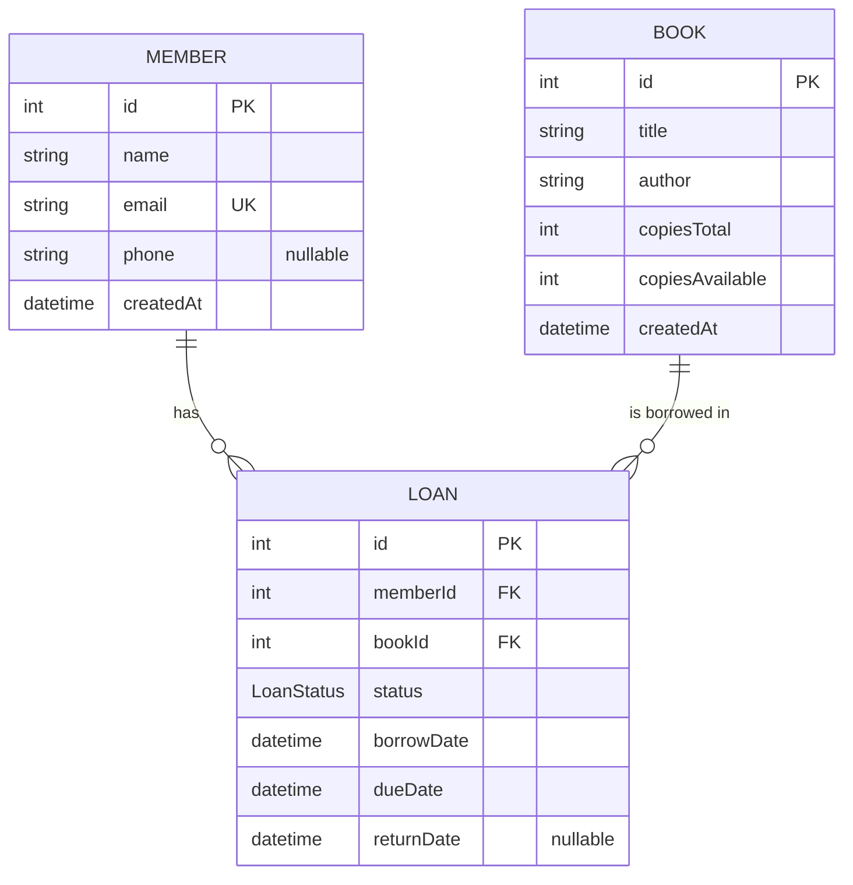

# 2. ERD & Data Dictionary

## ERD

## Data dictionary

### Member *(already in the schema)*

| Column | Type | Constraints |
|---|---|---|
| id | Int | PK, auto-increment |
| name | String | required |
| email | String | required, **unique** |
| phone | String | optional (nullable) |
| createdAt | DateTime | default: now |
| loans | Loan[] | relation: one member has many loans |

### Book *(already in the schema)*

| Column | Type | Constraints |
|---|---|---|
| id | Int | PK, auto-increment |
| title | String | required |
| author | String | required |
| copiesTotal | Int | required — copies the library owns |
| copiesAvailable | Int | required — copies on the shelf right now |
| createdAt | DateTime | default: now |
| loans | Loan[] | relation: one book has many loans |

### LoanStatus (enum) — *you create this (S5)*

| Value | Meaning |
|---|---|
| BORROWED | the book is out |
| RETURNED | the book came back |

### Loan — *you create this (S5)*

| Column | Type | Constraints |
|---|---|---|
| id | Int | PK, auto-increment |
| memberId | Int | FK → Member.id, required |
| bookId | Int | FK → Book.id, required |
| status | LoanStatus | required, **default: BORROWED** |
| borrowDate | DateTime | required, **default: now** |
| dueDate | DateTime | required |
| returnDate | DateTime | optional (nullable) — set when returned |
| member | Member | relation field |
| book | Book | relation field |
